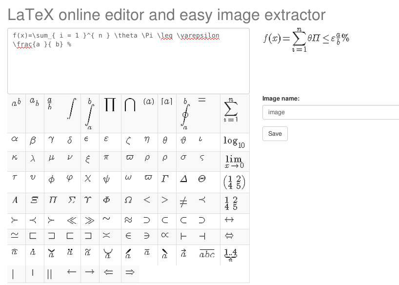

Introducing
============

Simple online editor of math formulas based on LaTeX syntax and easy image extractor.
With table of popular equations and chars for easy work with it if you forgot some equation.
Simple save image file to your download folder just one click( thanks [FileSaver.js](https://github.com/eligrey/FileSaver.js))!

## Docker (the easiest way to use this code)

1. Install Docker (if you still don't have it).

2. Build image:

`docker build  -t="latex" .`

3. Run image:

`docker run -d -p 8888:8888 -t latex`

4. And open your favorite browser (http://0.0.0.0:8888) 

## Manual installation

This editor uses [MimeTex](http://www.forkosh.com/mimetex.html) what parses a LaTeX math expression and immediately emits the corresponding gif image. MimeTex doesn't use Tex or it's fonts and you don't need any dependencies on your server!  

`git clone https://github.com/ar0ne/latex-equation-editor.git`

`mv latex-equation-editor /path/of/your/cgi-web-server/`

and start your http server if need it.

I usually use `python -m CGIHTTPServer` (recommend), but you can choose Apache or something else.

## Problems

If you have problems with generating image, maybe you must to download MimeTex from site and build it for your architecture and OS (see instruction on website). 

And I saw some problems with Apache server settings, first you must to setup it for execute CGI scripts.

## Licensed under the MIT license:

http://www.opensource.org/licenses/MIT